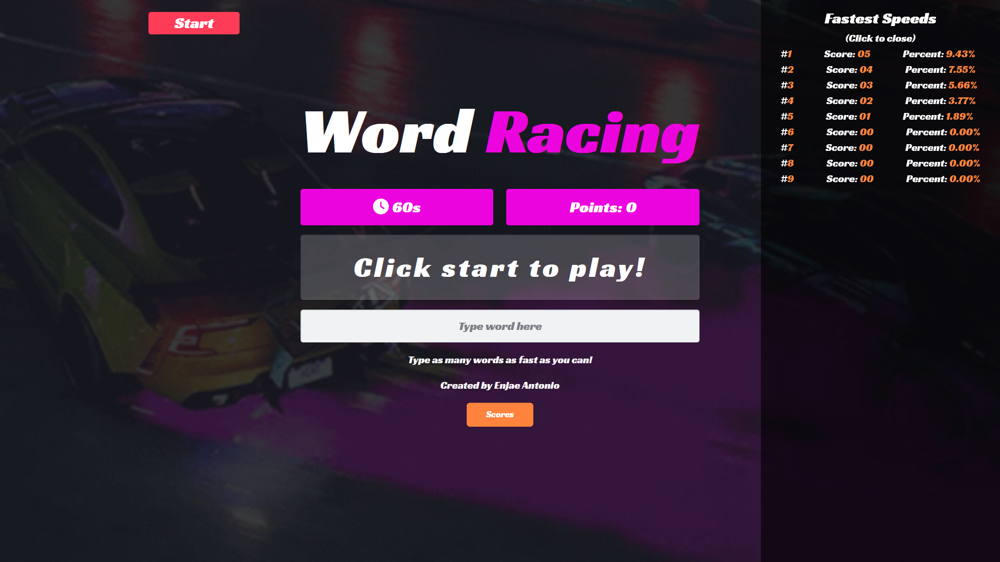

# <h1 align="center">Word Racing Game :car: </h1>

### Table of contents
- [Play Here!](https://enjaeantonio.github.io/word-racer)
- [Key Components](#Key-Components)
- [JavaScript Functions](#JavaScript)


  


## Introduction
This code is for a fast-paced Word Racing game, where players must type as many words as they can within a 60-second time limit. The game is built using JavaScript, HTML, and CSS. It features a start/reset button, a countdown timer, a random word generator, user input handling, and a leaderboard using 'localstorage' to store and display high scores. The game also incorporates audio for an engaging user experience. 



## Key Components

#### - HTML

The provided HTML code represents the structure the game. Within the main game section, there are multiple elements including the title, timer, point counter, random-word display, output message area, and an input field for typing words. 

```HTML 
   <section class="game flexbox">
                    <div class="game-input">
                        
                        <div class="title">
                            <h1>Word <span>Racing</span></h1>
                        </div>

                        <div class="count-points">
                            <div class="timer">
                                <h3><i class="fa-solid fa-clock"></i> 60s</h3>
                            </div>
                            
                            <div class="count">
                                <h3>Points: 0</h3>
                            </div>
                        </div>
                        
                        <div class="random-word">
                            <p></p>
                        </div>
                        
                        <section class="output">
                            <p>Click start to play!</p>
                        </section>
                        
                        <form action="">
                            <input class="user-input" type="text" placeholder="Type word here" autofocus>
                        </form>
                        
                        <p>Type as many words as fast as you can!</p>
                        <p>Created by Enjae Antonio</p>
                        <div class="result-wrapper">
                            <section class="result-page hidden">
                                <div class="result-card">
                                    <div class="results">
                                        <h2>Results!</h2>
                                        <h3>Date: <span>Wed Nov 30 2022</span></h3>
                                        <h3>Points: <span></span></h3>
                                        <h3>Percentage: <span></span></h3>
                                        <div class="btn-result-wrapper">

                                        </div>
                                    </div>
                                </div>
                            </section>
                            
                        </div>
                        <button class="high-scores">Scores</button>
                        
                    </div>
                    <section class="leaderboards">
                        <h2>Fastest Speeds</h2>
                        <p>(Click to close)</p>
                        <div class="leaderboard-card">
                            <div class="entree">
                            </div>
                        </div>
                    </section>
                </section>
```

## JavaScript

#### - GetRandomWord Function
The 'getRandomWord' function takes an array (arr) as an argument, which contains a list of words. It iterates through the array using a for loop, and for each iteration, it calculates a random index based on the length of the array. It then returns the word at the calculated random index from the input array. 

``` JavaScript
/*****************************************
        Random Word Function
*****************************************/
function getRandomWord(arr){
    for (let i = 0; i < words.length; i++) {
        arr[i] = Math.floor(Math.random() * arr.length);
        return arr[arr[i]]
    }
}
```

#### - Leaderboard Function

This code handles the storage and display of high scores for a game. It retrieves and parses high scores from local storage, updates the array with the latest score, and trims it to the top 10 entries. The updated high scores are then stored back in local storage. The displayScores function generates an HTML string to showcase the high scores on a leaderboard, which is rendered on the page.

``` JavaScript
// Creating my leaderboard 

leaderboardWrapper.classList.remove('hidden');

const score = {
    score: newPoints,
    percentage: newPerc
};

// Pushing and sorting my score object into an array
highScores.push(score);

highScores.sort((a,b) => b.score - a.score);

highScores.splice(9);

localStorage.setItem('highScores', JSON.stringify(highScores));

displayScores();

};

/*****************************************
        Display the leaderboard
*****************************************/

function displayScores(){
let index = 1;

const highScores = JSON.parse(localStorage.getItem('highScores')) || [];

    leaderboard.innerHTML = highScores.map(score => {
        return `<div class="entree">
                    <li> #<span>${index++}</span></li>
                    <li> Score: <span>${score.score}</span></li>
                    <li> Percent: <span>${score.percentage}%</span></li>
                </div>`
    }).join('');
};

displayScores()
```


